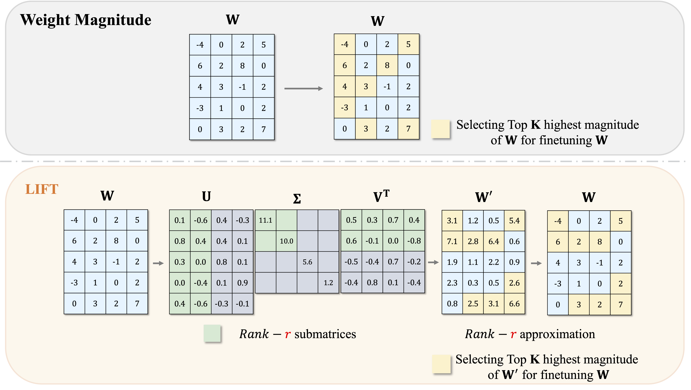

# LIFT the Veil for the Truth: Principal Weights Emerge after Rank Reduction for Reasoning-Focused Supervised Fine-Tuning

Zihang Liu, Tianyu Pang, Oleg Balabanov, Chaoqun Yang, Tianjin Huang, Lu Yin, Yaoqing Yang, Shiwei Liu

[Link to Paper](https://arxiv.org/abs/2506.00772)

<p align="center">
    
</p>

### Environment Setup
```bash
# create conda environment and install packages from requirements.txt
conda create -n lift python=3.10
conda activate lift
pip install -r requirements.txt

# install LLM-Adapters repository to obtain datasets
git clone https://github.com/AGI-Edgerunners/LLM-Adapters.git
```

## Fine-tuning LLaMA-2-7B on MATH-10K dataset
In ```./bash_scripts/finetune_math_lift_llama2_7b.sh```, change the following directories to your actual directories:
```bash
SRC_DIR=/enter/your/path/to/the/repo
DATA_DIR=/enter/your/data/dir
OUTPUT_SRC_DIR=/enter/your/output/dir
```
Then in ```./bash_scripts/eval_math.sh```, change corresponding directories to actual directories:
```bash
SRC_DIR=/enter/your/path/to/the/repo
DATA_DIR=/enter/your/data/dir
```
Then, run the training script:
```bash
bash ./bash_scripts/finetune_math_lift_llama2_7b.sh
```
It will automatically run fine-tuning LLaMA-2-7B on MATH-10K with `LIFT` method, and run evaluation on seven arithmetic reasoning tasks.